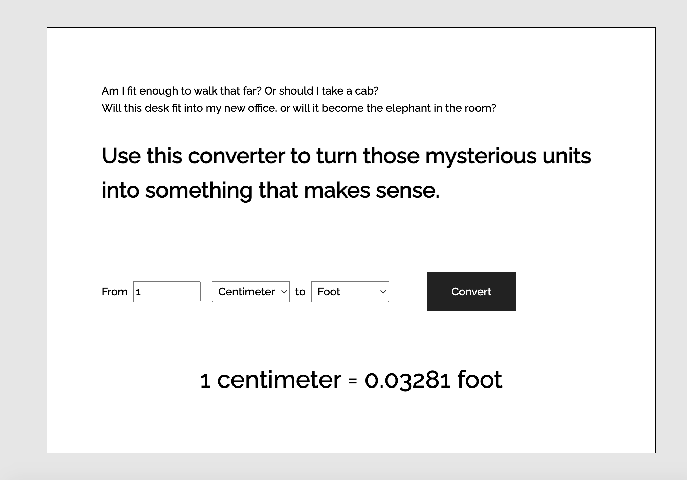

# Conversion Tool

This is a solution to an interview challenge, during which I got a brain freeze and so couldn't complete the task on the spot.

## User's Story

A European user goes to the U.S and needs a tool that would help them convert units back and forth (e.g. km to miles, cm to inch, etc.)

### Tasks

- create a function that accepts 3 parameters: input, unit1 and unit2
- calculate and return the value based on the 3 parameters, e.g. 1 cm = 0.032 ft

### Hints

- use object / map to store conversion values
- use a middle value to simplify the object structure

### Screenshot

### Links

[Live Site URL](https://miri52.github.io/interview-challenge/)

### Further improvements

- improve responsiveness, think mobile first
- improve accessibility
